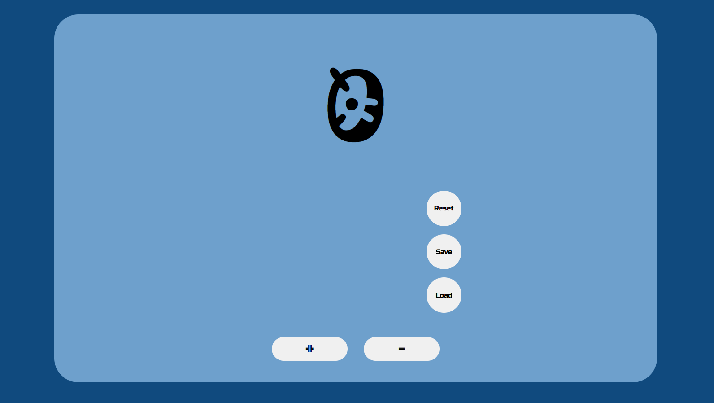

# 🔢  simple-counter 

A simple web application that allows users to increase, decrease, reset, save, and load a counter value.

---

## 🚀 Features

- ➕ Increase counter  
- ➖ Decrease counter  
- 🔄 Reset counter  
- 💾 Save counter using Local Storage  
- 📂 Load saved counter  
- 📱 Responsive design  

---

## 🛠️ Technologies Used

- HTML  
- CSS  
- JavaScript  

---

## 📸 Preview



---

## 📂 Project Structure

```
Countrol_Couter/
├── Preview_img/
│   └── preview.png
├── index.html
├── script.js
└── style.css
```


---

## ⚙️ How It Works

- Click **+** to increase the number  
- Click **-** to decrease the number  
- Click **Reset** to set it back to 0  
- Click **Save** to store the value in browser storage  
- Click **Load** to retrieve saved value  

---

## 🌐 Live Demo

👉  https://tyvisal.github.io/simple-counter/

---

## 🧠 Key Concept Used

- DOM Manipulation  
- Event Handling  
- Local Storage (`localStorage`)  

---

## 👨‍💻 Author

- Ty Visal
